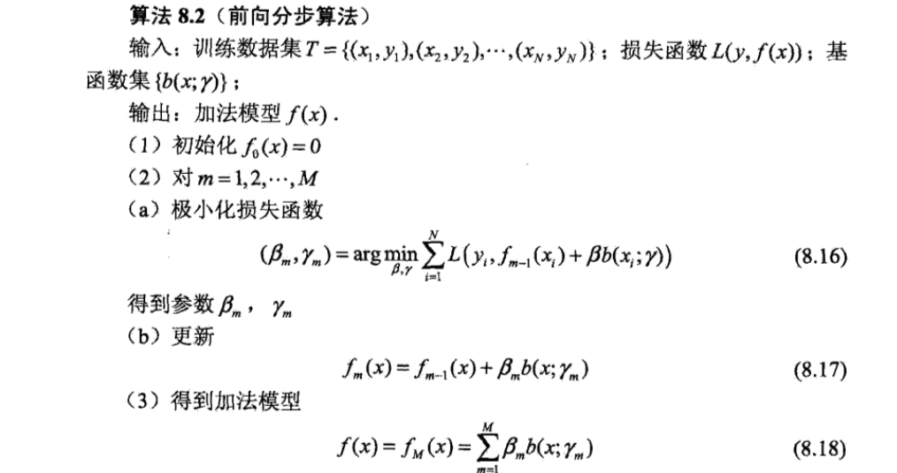

# GBDT-梯度提升树算法 梳理

GBDT(Gradient Boosting Decision Tree)是一种迭代的决策树算法,属于集成学习中的Boosting,在迭代的过程中使用了前向分布算法,基学习器为CART回归树模型

#CART分类回归树
Classification and Regression Tree

随着划分(分裂)过程不断进行,我们希望决策树的分枝节点所包含的样本尽可能属于同一类别,即节点的纯度越来越高

##CART LOSS的选择
分裂的目的是让数据变得跟纯,使得决策树的输出更接近真实值
**分类树**:
采用最小化基尼指数
$$GINI = 1 - \sum_{i\in I}$$
节点越不纯,GINI越大
**回归树**:
采用最小化均方误差
$$σ=\sqrt{\sum_{i \in I}(x_i - μ)^2}=\sqrt{\sum_{i \in I}x_i^2 - nμ^2}$$
方差越大表示该节点的数据越分散,预测效果越差.

#GDBT
GDBT中的树都是回归树,核心是累加所有树的结果最后最终结果

##前向分布算法

在Adaboost算法中,最终目的是通过构建弱分类器的线性组合:
$$f(x)=\sum_{m=1}^Mα_mG_m(x)$$
来得到最终分类器,在加法模型
$$f(x)=\sum_{m=1}^Mw_mb(x;r_m)$$
其中$b()$是基学习器
中若给定训练数据和loss function,学习加法模型就转化为经验风险极小化损失函数极小化问题:
$$\mathop{min}\limits_{w_m,r_m}\sum_{i=1}^NL(y_i,\sum_{m=1}^Mw_mb(x_i;r_m))$$
为了简化这一求解过程,**前向分布算法**提出:
若学习的是加法模型,从前往后,每一步学习一个基学习器和对应权重,然后逐步逼近优化目标,每一步只学习:
$$\mathop{min}\limits_{w_m,r_m}\sum_{i=1}^NL(y_i,wb(x,r_m))$$
具体算法流程:

**总结**:
在GDBT的迭代中,假设学习到的强学习器是$f_{t-1}(x)$损失函数是$L(y,f_{t-1}(x)$,迭代的目标是找到一个CART回归树模型的基学习器$h_t(x)$,让本轮的损失函数$L(y,f_t(x)=L(y,f_{t-1}(x)+h_t(x))$最小,当前轮次迭代找到的决策树要让样本的损失尽量最小.
##负梯度拟合
一般的回归树,采用平方误差函数,根据前向分布算法每次只要达到最优化,就能保证整体性能
在损失函数$L(y,f(x))$中,将$f(x)$看做参数,从梯度下降求$minL$
$$f(x)_m = f(x)_{m-1} - (\frac{dL(y,f(x))}{df(x)})$$
而$f(x)_m = f(x)_{m-1}+T(x;Q)$是前向分布算法得到的第m棵树的参数,$T(x;Q)$为训练的新树,因此$T(x;Q)= -\frac{dL(y,f(x)}{df(x)}$,等式左边为预测值,右边为真实值,整个过程就成为了每次拟合损失函数的负梯度值

##损失函数

### 分类损失
**指数损失函数**
    $$L(y,h(x))=exp(-yh(x))$$
**对数损失函数**
对于二分类
$$L(y,h(x))=log(1+exp(-yh(x)))$$

### 回归损失
**均方差**:
$$L(y,h(x)) = (y-h(x))^2$$
**绝对损失**:
$$L(y,h(x))=|y-h(x)|$$
对应负梯度:
$$sign(y_i-f(x_i))$$
**Huber损失**:
参考了均方差和绝对损失,对于原理中兴的异常点,采用绝对损失,而中心附近的点采用均方差,用分位数点度量确定界限.

##GBDT小节
**优点**:
(1)可以灵活处理各种类型的数据,包括连续值和离散值
(2)相对于SVM准确率高
(3)实用健壮的损失函数,对异常值的鲁棒性强,比如Huber损失函数

**缺点**:
基学习器之间存在依赖关系,难以并行训练数据

